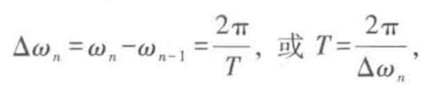

# Fourier积分
## 周期函数

> 值得注意的是`cos` 和`sin`构成的基底是正交的
>  - 断点
> 
> 

复指数形式

展开

## 非周期函数

非常精妙的是这一步-->求和变积分

- Fourier积分公式

> 
> 
> 会发现 cos 和 sin 等不符合要求

以及 cos 是偶函数

### 解析延拓

- 奇函数

- 偶函数

### exercise

### eg-01

### eg-02

- 偶延拓

同上

- 奇延拓

> 奇妙的是，不同的表达式，t>0 时有相同的结果
> 
> `sgn(x)=2*H(x)-1`，这些函数之间也可以构造联系

