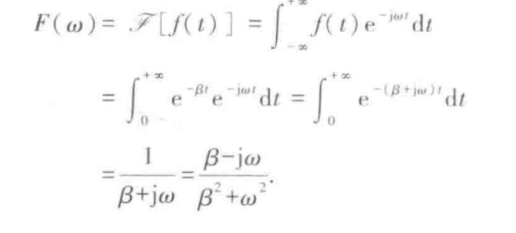

# Fourier变换

## concept

- Fourier变换

- Fourier逆变换

> 抽象，关注整体的变换关系，用以下记法

> 可以说象函数F(w)和象原函数f(t)构成了一个Fourier变换对，它们有相同的奇偶性.
> 
> 考虑奇偶性，于是有正弦和余弦变换

> 考虑象函数的关系，根据积分变换的核，很好猜出关系

### exercise

> 可以看到 Laplace 变换的结构

首先,换元

转化积分路径

AD = BC = 0,AB = 高斯积分

## 单位脉冲函数

对于许多集中于一点或一瞬时的量，例如点电荷、点热源、集中于一点的质量以及脉冲技术中的非常窄的脉冲等，就能够像处理连续分布的量那样，以统一的方式加以解决

δ-函数是一个广义函数，它没有普通意义下的“函数值”，所以，它不能用通常意义下“值的对应关系”来定义.在广义函数论中，δ-函数定义为某基本函数空间上的线性连续泛函

性质 1

性质 2:筛选性

> 也可用来作定义

利用筛选性

此处反常积分不是普通意义下的积分值.所以，δ(t)的Fourier变换是一种广义Fourier变换.

> 利用逆变换证明

