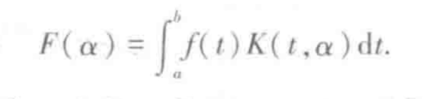

# 积分变换

[工程数学-积分变换 东南大学数学学院 张元林编 第六版]()

不仅是与时俱进，让读者的精力更多地集中在基本概念、性质及变换技巧的学习和研究上，而且还为读者增添了一种新的解题方法，也为相关工程技术人员和科研工作者的需要提供了一个易学好用、方便快捷的有效工具。

## 引 言

为了把较复杂的运算转化为较简单的运算，常常采取一种变换手段例如数量的乘积或商可以通过对数变换变成对数的和或差，然后再取反对数，即得到原来数量的乘积或商

解析几何中的坐标变换、复变函数中的保角变换等

所谓积分变换，就是通过积分运算，把一个函数变成另一个函数的变换

K 称为积分变换的核

用积分变换去解微分方程或其他方程，就如同用对数变换计算数量的乘积或商一样
