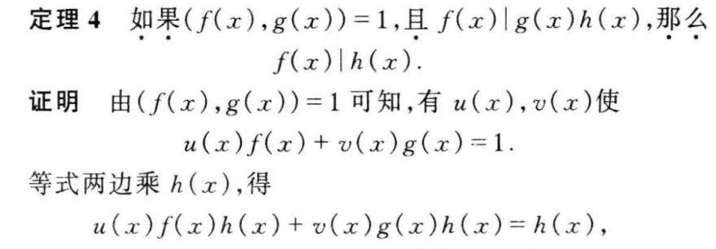
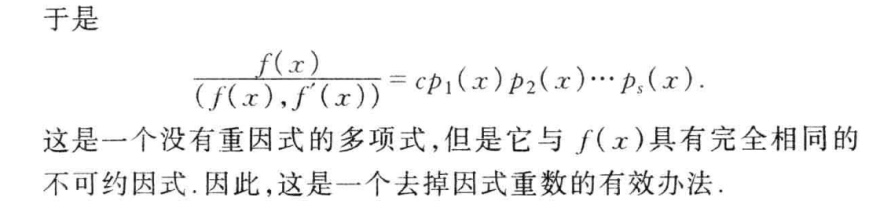
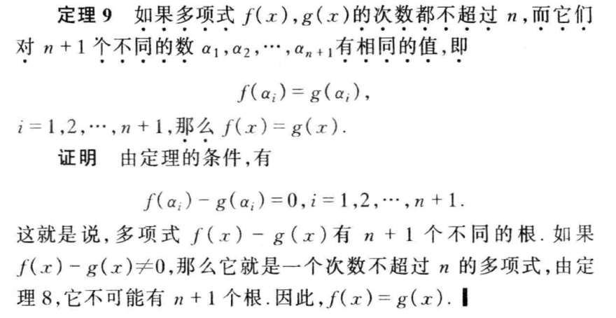
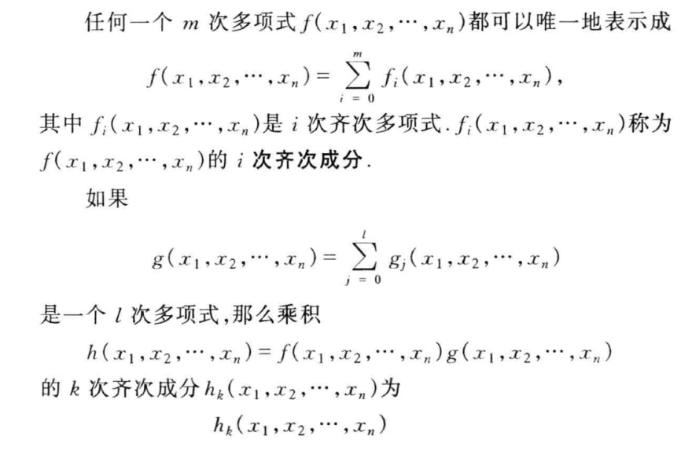
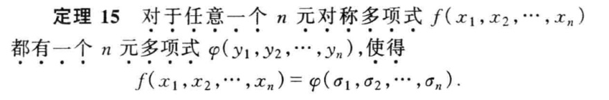
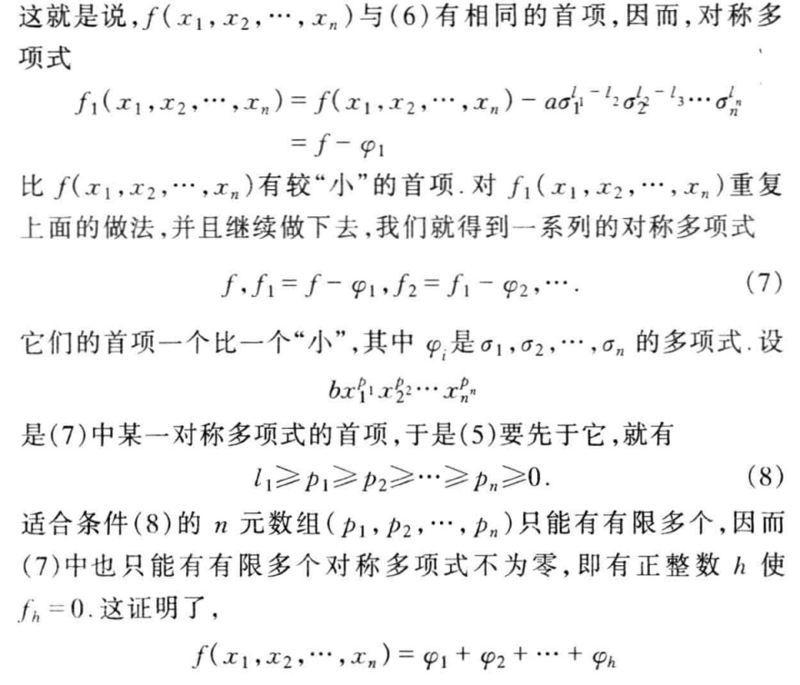
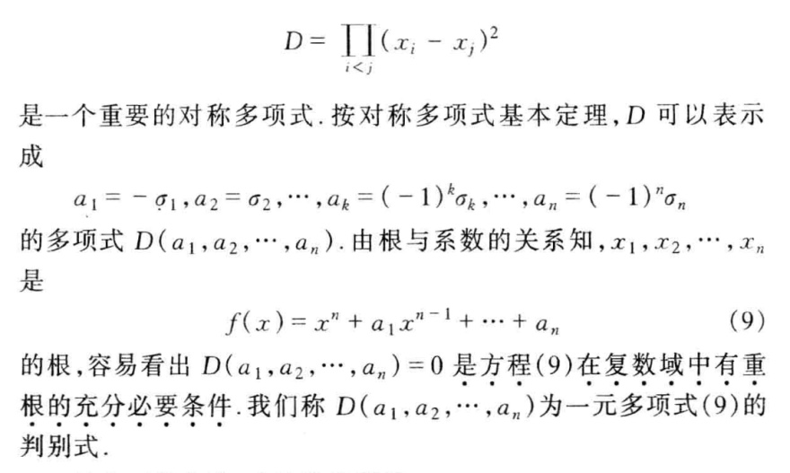

- [多项式](#多项式)
  - [数域](#数域)

# 多项式

## 数域

```txt

数的概念经历了长期发展的过程, 从自然数, 到整数, 有理数, 然后是实数, 复数, 反映了人们对客观世界的认识不断加深

```

> 挺玄妙的, 在实数里面, -1 不可开方, 在自己已有的认知里面, 也有些不可能, 不知道在这不可能后面是不是有一个更广大的 **`域`** .

```txt

一元二次方程是否有解就与未知量所代表的对象有关, 也就是与未知量允许的取值范围有关

```
如果数的集合P中任意两个数做某一运算的结果仍在P中, 我们就说数集p对这个运算是 `封闭的`.

,数域的定义也可以说成,如果一个包含0,1在内的数集P对于加法、减法、乘法与除法(除数不为0)是封闭的,那么p就称为一个数域.

## 一元多项式

NOTE: 数域P上的一元多项式, 指的是系数全属于P, 与符号x无关, **`只与系数有关`**

所有的系数的一元多项式全体构成`多项式环`, `P[x]`


看到了线性叠加


> 挺巧妙地运用呀



> 利用微分的性质




为什么在线性代数里会存在多项式呢？

复数域与实数域既然都是数域，因此前面所得的结论对它们也是成立的.但是这两个数域又有它们的特殊性，所以某些结论就可以进一步具体化
> 有点虚函数的味道




> 和卷积的结构非常相似





>  核心即使递归，通过字典排序的最大项不断减小来控制




